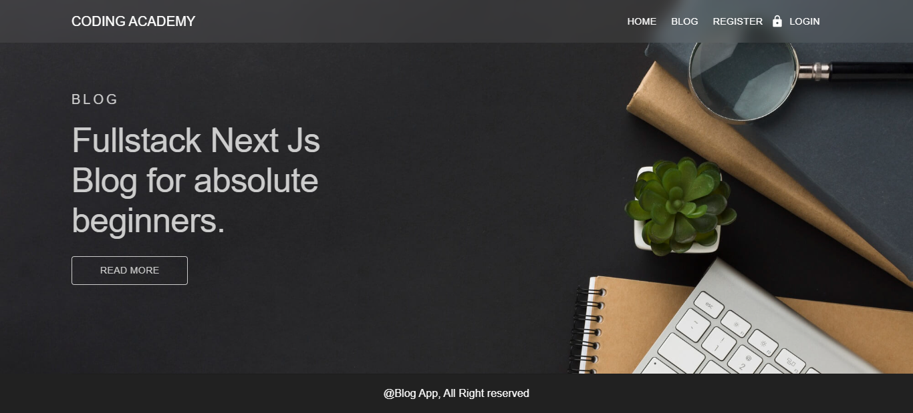
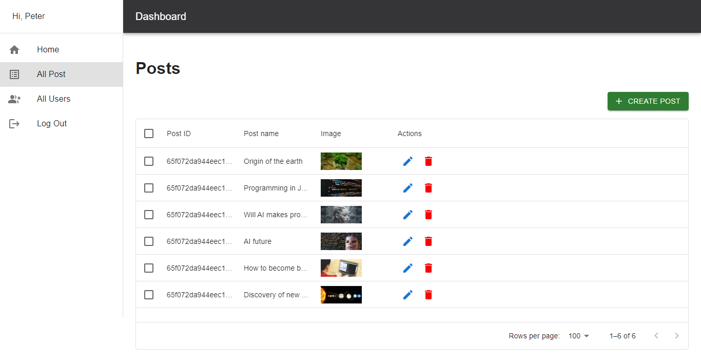

# Next.Js Blog with MongoDB - MUI for beginners
This project is a simple fullstack blog with User dashboard aims to teach all the basics to build a fullstack App.

# Features:
##### - Next Js folder structure and Routing
##### - UI interface with form validation
##### - API
##### - CRUD operation  with Mongo DB / Mongoose
##### - Encrypt password
##### - Authentication / Authorization
##### - Middleware
##### - Protected Route
##### - User role
##### - Toast Notification
##### - Dashboard / active link

